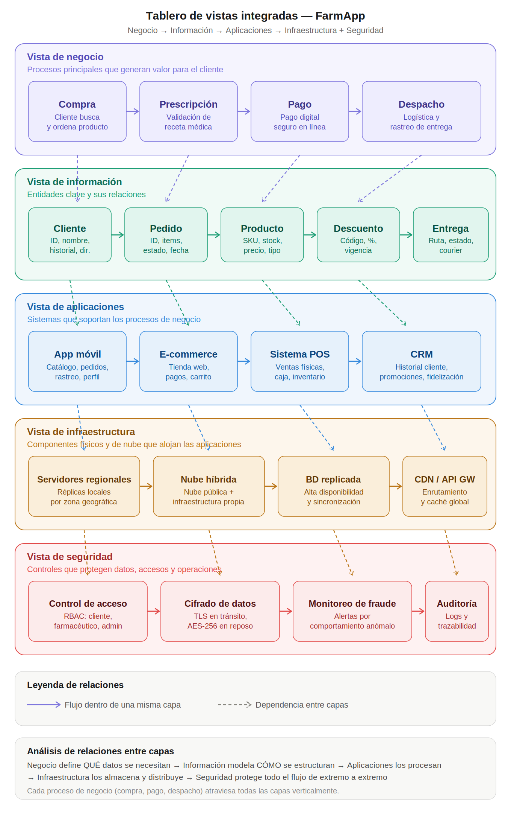

# 🗒️ Registro de Trabajo en Clase - Taller 7

## 📆 Fecha de la sesión

_Mayo 2026 — Sesión de Arquitectura Empresarial, Universidad de La Sabana._

---

## 👥 Integrantes presentes

- Valentina López
- Mariana Valle
- Camila León

---

## 🧠 Actividades realizadas en clase

Durante la sesión del taller, el equipo realizó las siguientes actividades:

- **Discusión del caso FarmApp:** Se analizó el contexto del sistema, identificando los actores principales (cliente, farmacéutico, administrador, operador logístico) y los procesos de negocio críticos (compra, prescripción, pago y despacho).

- **Identificación de las cinco vistas arquitectónicas:** Se discutió qué elementos pertenecen a cada capa —negocio, información, aplicaciones, infraestructura y seguridad— y cómo se diferencian entre sí conceptualmente.

- **Decisiones de modelado tomadas:**
  - Se acordó representar las vistas de forma apilada verticalmente para que la dirección de las flechas mostrara claramente la dependencia de cada capa sobre la anterior.
  - Se decidió usar flechas sólidas para relaciones dentro de una misma capa y flechas punteadas para dependencias entre capas, diferenciando así el tipo de relación visualmente.
  - Se estableció que la vista de seguridad sería la última capa pero con flechas transversales hacia arriba, para comunicar que actúa sobre todas las demás vistas.
  - Se eligió asignar un color distinto a cada capa: púrpura (negocio), verde/teal (información), azul (aplicaciones), ámbar (infraestructura) y rojo (seguridad).

- **Análisis de relaciones entre capas:** Se identificó que cada proceso de negocio atraviesa verticalmente todas las capas. Se usó como ejemplo el proceso de compra para trazar el flujo completo desde el negocio hasta los controles de seguridad.

- **Herramientas usadas:** El tablero fue trabajado digitalmente utilizando draw.io y luego exportado como imagen para el repositorio. Las discusiones iniciales se realizaron de forma verbal con apoyo de notas compartidas.

- **Avance alcanzado:** Se completó el tablero integrado de vistas para el caso base de FarmApp, incluyendo las cinco capas con sus componentes, las relaciones horizontales entre componentes de cada capa y las dependencias verticales entre capas. También se identificaron los principales riesgos y puntos de dolor del modelo.

---

## 🧩 Boceto inicial del modelo

> A continuación se presenta el tablero integrado de las cinco vistas arquitectónicas de FarmApp, desarrollado durante la sesión:

_El tablero muestra las cinco capas (negocio, información, aplicaciones, infraestructura y seguridad) con sus componentes internos, relaciones horizontales dentro de cada capa (flechas sólidas) y dependencias verticales entre capas (flechas punteadas)._

---

## 🔁 Tareas definidas para complementar el taller

| Tarea asignada | Responsable | Fecha estimada |
|----------------|-------------|----------------|
| Modelado final del tablero integrado del cliente real en draw.io | Valentina López | 26/05 |
| Redacción del informe narrativo de coherencia arquitectónica | Camila León | 27/05 |
| Investigación de referencias y ejemplos reales de documentación de vistas | Mariana Valle | 27/05 |
| Aplicación de las vistas al cliente real (Universidad de La Sabana) | Todas | 28/05 |
| Revisión final y consolidación del repositorio | Mariana Valle | 29/05 |

---

_Este documento resume el trabajo colaborativo realizado durante la sesión del Taller 7 en el curso de Arquitectura Empresarial - Universidad de La Sabana._
